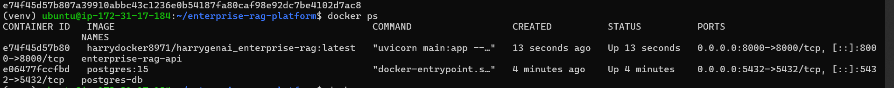
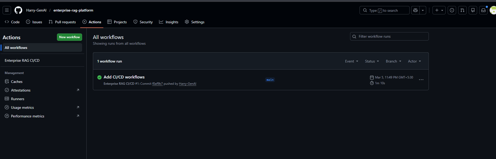
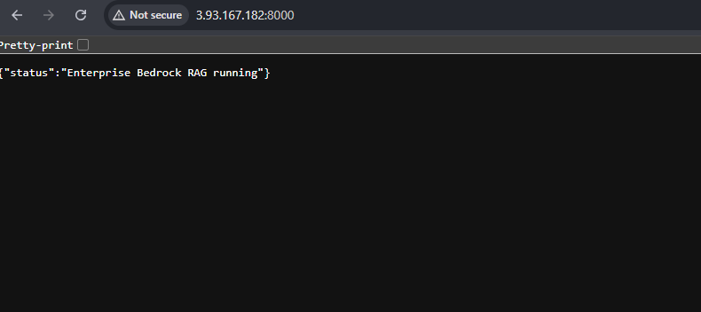

# Enterprise GenAI Platform (Production RAG API)

Production-style Retrieval Augmented Generation (RAG) API built with **FastAPI + LangChain + FAISS**.
The system is fully **containerized using Docker** and automatically **deployed to AWS EC2 using GitHub Actions CI/CD**.

---

# Architecture Overview

### Application Architecture

Client
↓
FastAPI RAG API
↓
FAISS Vector Search
↓
LLM Response Generation
↓
PostgreSQL (Chat History)

---

### Deployment Architecture

Developer Push
↓
GitHub Repository
↓
GitHub Actions CI/CD
↓
Docker Image Build
↓
Docker Hub Registry
↓
AWS EC2 Deployment
↓
FastAPI RAG API Container

---

# Tech Stack

### Backend

* FastAPI
* Python
* LangChain

### AI Components

* FAISS Vector Database
* Retrieval Augmented Generation (RAG)
* Prompt Engineering

### Infrastructure

* Docker
* GitHub Actions CI/CD
* AWS EC2

### Database

* PostgreSQL

---

# Project Structure

```
enterprise-rag-platform
│
├── main.py
├── rag.py
├── ingest.py
├── db.py
├── llmservice.py
├── logger.py
├── guardrails.py
│
├── faiss_index/
├── docs/
│
├── Dockerfile
├── requirements.txt
│
└── .github/workflows
    └── deploy.yml
```

---

# Running Locally

Clone repository

```
git clone https://github.com/<your-username>/enterprise-rag-platform.git
cd enterprise-rag-platform
```

Install dependencies

```
pip install -r requirements.txt
```

Create FAISS index

```
python ingest.py
```

Run API

```
uvicorn main:app --host 0.0.0.0 --port 8000
```

Open browser

```
http://localhost:8000
```

---

# Docker Deployment

Build Docker image

```
docker build -t enterprise-rag .
```

Run container

```
docker run -d -p 8000:8000 \
-v ./faiss_index:/app/faiss_index \
enterprise-rag
```


---

# CI/CD Pipeline

The system uses **GitHub Actions for automated deployment**.



Pipeline flow:

1. Developer pushes code to GitHub
2. GitHub Actions builds Docker image
3. Image pushed to Docker Hub
4. EC2 server pulls latest image
5. Old container stopped and new container started automatically

This enables **automatic deployment on every push to the main branch**.

---

# API Example

Health check endpoint

```
GET /
```

Response

```
{
  "status": "Enterprise Bedrock RAG running"
}
```
### Running API on EC2


---

# Features

* Production-style RAG pipeline
* Document ingestion pipeline
* FAISS vector retrieval
* Chat history stored in PostgreSQL
* Dockerized deployment
* Automated CI/CD with GitHub Actions
* AWS EC2 hosting

---

# Future Improvements

- Redis caching for conversation memory
- Streaming responses for real-time LLM replies
- Document storage using AWS S3 instead of local EC2 storage
- Migration to managed database (AWS RDS)

---

# Author

Harry — GenAI / LLMOps Engineer
